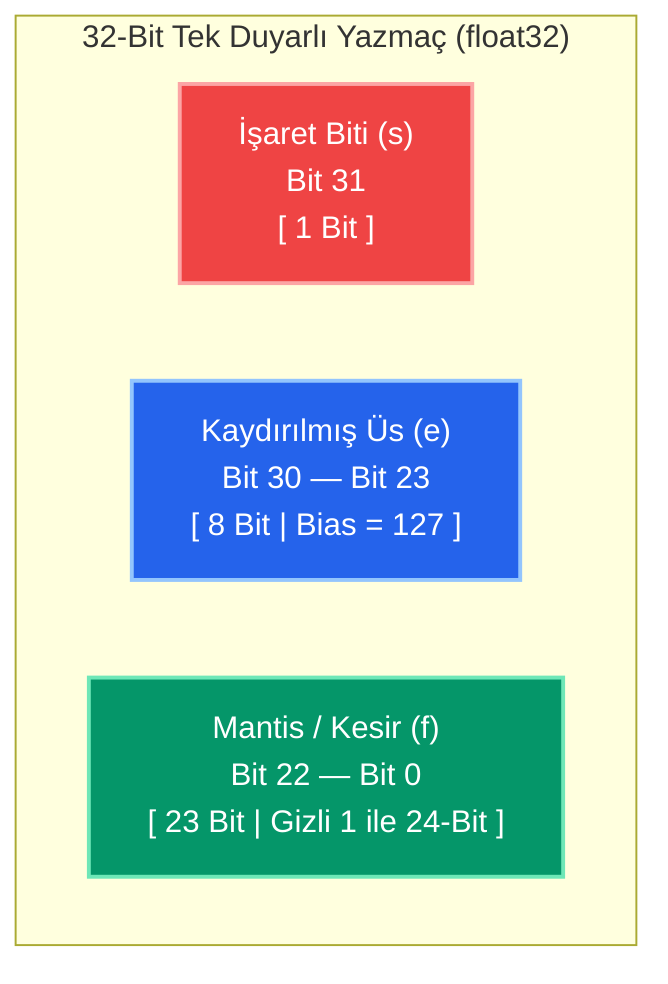

> 🧭 **Ders Akışı:** [[Hafta 1/Sayısal Yöntemler 01|🏠 Hafta 01: Hata Analizi]] ➔ **[Hafta 02: Bilimsel Gösterim & Kayan Nokta]**

---

# 🔢 Normalleştirilmiş Bilimsel Gösterim ve Kayan Noktalı Sayılar

Sayısal yöntemlerde ve bilgisayar mimarisinde, çok büyük veya çok küçük sayıların standart ve hassas bir biçimde saklanıp işlenebilmesi için **normalleştirilmiş bilimsel gösterim** (normalized scientific notation) kullanılır. Bu gösterim hem onluk (desimal) hem de ikilik (binary) sistemde geçerlidir.

---

## 1. Onluk (Desimal) Sistemde Normalleştirilmiş Bilimsel Gösterim

Desimal sistemde herhangi bir reel sayı normalleştirilmiş bilimsel gösterimle ifade edilebilir. Bu kurala göre; **tüm anlamlı rakamlar desimal noktanın (virgülün) sağında kalacak şekilde ve ilk rakam (virgülün solundaki tam kısım) sıfır ($0$) olacak şekilde** desimal nokta kaydırılır ve $10$’un uygun kuvvetleri kullanılır.

### Matematiksel Tanım

Sıfırdan farklı herhangi bir $x$ sayısı için, $\frac{1}{10} \le r < 1$ aralığında bir reel sayı ve $n$ bir tam sayı ($n \in \mathbb{Z}$) olmak üzere:

$$x = \pm r \times 10^n$$

formunda temsil edilir.

* **$r$ (Mantis / Anlamlı Kısım):** $0{,}1 \le r < 1$ aralığındadır. Yani virgülden sonraki ilk basamağı kesinlikle sıfırdan farklıdır ($1, 2, \dots, 9$).
* **$n$ (Üs / Derece):** Desimal noktanın kaç basamak kaydırıldığını belirten tam sayıdır.
* **$x = 0$ durumu:** $x = 0$ ise $r = 0$ ve $n = 0$ kabul edilir. Diğer tüm durumlarda $r$ verilen aralıkta ($0{,}1 \le r < 1$) kalacak şekilde $n$ tam sayısı ayarlanır.

---

### 📝 Örnek Alıştırmalar ve Çözümleri

> [!CHECK] Soru 1: $732{,}5051$
> **Cevap:**
> $$732{,}5051 = +0{,}7325051 \times 10^3$$
> * **İşaret:** $+$ (Pozitif)
> * **Mantis ($r$):** $0{,}7325051$ $\longrightarrow$ $\left(\frac{1}{10} \le 0{,}7325051 < 1\right)$ koşulu sağlanır.
> * **Üs ($n$):** $3$ *(Desimal nokta tüm rakamlar sağda kalacak şekilde 3 basamak sola kaydırılmıştır).*

> [!CHECK] Soru 2: $-0{,}005612$
> **Cevap:**
> $$-0{,}005612 = -0{,}5612 \times 10^{-2}$$
> * **İşaret:** $-$ (Negatif)
> * **Mantis ($r$):** $0{,}5612$ $\longrightarrow$ $\left(\frac{1}{10} \le 0{,}5612 < 1\right)$ koşulu sağlanır.
> * **Üs ($n$):** $-2$ *(Desimal nokta ilk anlamlı basamak virgülden hemen sonra başlayacak şekilde 2 basamak sağa kaydırılmıştır).*

---

## 2. İkilik (Binary) Sistemde Normalleştirilmiş Bilimsel Gösterim (Klasik Kitap Tanımı)

Tamamen aynı prensip ve yaklaşımla bilimsel gösterim ikilik sistem (taban 2) için de kullanılır. Sıfırdan farklı bir $x$ sayısı ($x \neq 0$) için:

$$\frac{1}{2} \le q < 1 \quad \text{ve} \quad m \in \mathbb{Z}$$

olmak üzere $x$ reel sayısı:

$$x = \pm q \times 2^m$$

şeklinde temsil edilir.

* **Mantis ($q$):** Anlamlı sayılar kısmı (Significand / Mantissa). İkilik sistemde $\frac{1}{2} \le q < 1$ olması demek, virgülden sonraki ilk bitin **mutlaka 1 olması** demektir: $q = (0{,}1b_2b_3b_4\dots)_2$.
* **Üs ($m$):** $2$'nin kuvveti olan pozitif ya da negatif tam sayıdır.
* **Bit:** $0$ ve $1$ değerleridir.

---

## 3. 32-Bitlik Bir Bilgisayarda Kayan Noktalı Sayı Temsili (Tek Duyarlılık - Single Precision / float32)

32-bitlik bir bilgisayar sisteminde tek duyarlıklı (single precision) bir reel sayı toplam 32 bitten oluşan 3 temel alanda saklanır:

![[kayan_nokta_32bit.png]]



### 32-Bit Bellek Bloklarının Analizi

| Alan | Bit Konumu | Bit Genişliği | Anlamı ve Görevi | Kuralı / Değer Aralığı |
| :--- | :---: | :---: | :--- | :--- |
| **İşaret ($s$)** | **Bit 31** | **1 Bit** | Sayının pozitif veya negatif olduğunu belirtir. | `0` = Pozitif ($+$)<br>`1` = Negatif ($-$) |
| **Kaydırılmış Üs ($e$)** | **Bit 30 – 23** | **8 Bit** | Sayının ölçeğini/mertebesini tutar. $127$ eklenerek saklanır. | $e = m + 127$<br>$(1 \le e \le 254)$ |
| **Mantis / Kesir ($f$)** | **Bit 22 – 0** | **23 Bit** | Sayının virgülden sonraki anlamlı kesir bitlerini tutar. | $(1{,}f)_2$ yapısı ile 24-bit etkin duyarlılık |

---

## 4. Sol Kaymalı Normalleştirilmiş İkilik Sayı Modeli (Hocanın Sınav Formülü)

> [!WARNING] 🚨 HOCANIN SINAV TALİMATI: "BENİM ÖĞRETTİĞİM GİBİ ÇÖZÜN!"
> Hoca sınavda tüm kayan noktalı sayı sorularının **kendi yazdırdığı sol kaymalı model formülü** üzerinden çözülmesini kesin olarak şart koşmuştur! Sınavda soru çözümüne başlarken doğrudan şu formülü yazarak başlayınız:
> 
> $$\mathbf{x = (-1)^s (1{,}f) \times 2^{e - 127}}$$

### Formülün Bileşenleri ve Kuralları:

1. **İşaret Biti ($\mathbf{s}$ - 1 Bit):**
   * $(-1)^s$ terimi sayının işaretini üretir.
   * **Pozitif Sayı ($+$):** $\mathbf{s = 0} \implies (-1)^0 = +1$
   * **Negatif Sayı ($-$):** $\mathbf{s = 1} \implies (-1)^1 = -1$
   > [!NOTE] 🔍 Tahta Notu Düzeltmesi
   > Tahtadaki *"Pozitif bit 3, negatif bit 1"* ifadesinde; hocanın tahtaya çok küçük yazmasından ötürü **0 (sıfır)** rakamı yanlışlıkla **3** olarak okunmuştur. Pozitif sonuç $(-1)^0 = +1$ olduğundan **pozitif için bit daima 0'dır**.

2. **Mantis Kısmı ($\mathbf{1{,}f}$ ve $\mathbf{f}$ - 23 Bit):**
   * Sol kaymalı modelde virgülün solunda daima tek bir basamak ($1$) kalır:
     $$q = (1{,}f)_2 \quad \text{ve} \quad 1 \le q < 2$$
   * **Gizli 1 (Hidden Bit) Tasarrufu:** Baştaki $1$ sayısı normalleştirilmiş tüm sayılarda **hep aynı (sabit)** olduğundan belleğe yazılmaz!
   * Mantis için ayrılan 23 bite yalnızca virgülden sonraki **$f$ (kesir) kısmı** yüklenir.
   * **Makine Duyarlılığı:** 23 bit harcanarak donanımda **24 bitlik bir mantis hassasiyeti** sağlanır.

3. **Üs Kuvveti ($\mathbf{e}$ - 8 Bit):**
   * Formüldeki üs terimi $\mathbf{2^{e - 127}}$ şeklindedir.
   * Normalleştirme sonucunda bulduğumuz gerçek üs $m$ ise:
     $$e - 127 = m \implies \mathbf{e = m + 127}$$
   * Buradan elde edilen $e$ tam sayısı 8 bitlik ikilik sayıya çevrilerek yazmaca kaydedilir.

---

### 📋 Sınav İçin Standart Çözüm Şablonu (Adım Adım)

Bir $x$ reel sayısını 32-bit kayan noktalı sayıya dönüştürürken sınav kağıdına sırasıyla şu 5 adımı yazınız:

```text
Adım 1: Hocanın formülünü yaz: x = (-1)^s (1,f) * 2^(e - 127)
Adım 2: İşareti belirle: Pozitif ise s = 0, Negatif ise s = 1
Adım 3: Sayıyı ikiliğe çevir ve sol kaymalı olarak (1,f)_2 * 2^m şeklinde normalize et
Adım 4: e - 127 = m eşitliğinden e = m + 127 değerini bul ve 8 bite çevir
Adım 5: f kısmını 23 bite tamamla ve yazmacı [s] [e] [f] olarak göster
```

---

### 💡 Soru Çözümleri (Hocanın Formülüne Göre)

#### Örnek 1: $x = -13{,}625$ Sayısının 32-Bit Kayan Nokta Temsili

> [!QUESTION] Soru
> $x = -13{,}625$ reel sayısının 32-bitlik tek duyarlı kayan noktalı sayı (float32) karşılığını bulunuz.

**Hocanın Formülüyle Adım Adım Çözüm:**

* **Adım 1 (Formül):**
  $$x = (-1)^s (1{,}f) \times 2^{e - 127}$$

* **Adım 2 (İşaret Biti $s$):**
  Sayı negatif olduğundan:
  $$\mathbf{s = 1} \implies (-1)^1 = -1$$

* **Adım 3 (İkilik Dönüşüm ve Normalleştirme):**
  * Tam kısım: $13_{10} = (1101)_2$
  * Kesir kısım: $0{,}625_{10}$:
    * $0{,}625 \times 2 = \mathbf{1}{,}25 \to 1$
    * $0{,}250 \times 2 = \mathbf{0}{,}50 \to 0$
    * $0{,}500 \times 2 = \mathbf{1}{,}00 \to 1$
    * Kesir: $(0{,}101)_2$
  * Birleşik ikilik sayı: $(13{,}625)_{10} = (1101{,}101)_2$
  * Sol kaymalı normalleştirme:
    $$(1101{,}101)_2 = \mathbf{1{,}101101_2 \times 2^3}$$
    Buradan: $(1{,}f) = (1{,}101101)_2$ ve gerçek üs $m = 3$ bulunur.

* **Adım 4 (Kaydırılmış Üs $e$):**
  Hocanın formülündeki üs ifadesine göre:
  $$e - 127 = m \implies e - 127 = 3$$
  $$e = 3 + 127 = 130_{10}$$
  $$130_{10} = 128 + 2 = \mathbf{(10000010)_2} \quad (8 \text{ bit})$$

* **Adım 5 (Mantis $f$ ve 32-Bit Yazmaç):**
  * Baştaki $1$ gizli bittir (yazılmaz). Virgülden sonraki kesir kısmı:
    $$f = 10110100000000000000000_2 \quad (23 \text{ bit})$$

* **32-Bit Yazmaçta Nihai Görünüm:**

| İşaret ($s$) | Kaydırılmış Üs ($e$) | Mantis / Kesir ($f$) |
| :---: | :---: | :---: |
| **1 Bit** | **8 Bit** | **23 Bit** |
| `1` | `10000010` | `10110100000000000000000` |

* **Tek Parça Bit Dizilimi:**
  ```text
  1 10000010 10110100000000000000000
  ```
* **Onaltılık (Hexadecimal) Temsili:** `0xC15A0000`

---

#### Örnek 2 (Sınav Tipi Ters Soru): 32-Bit Yazmaçtan Sayıyı Bulma

> [!QUESTION] Soru
> 32-bit kayan noktalı bir yazmaçta `0 10000011 01000000000000000000000` bitleri tutulmaktadır. Hocanın formülünü kullanarak bu sayının gerçek desimal karşılığını hesaplayınız.

**Hocanın Formülüyle Adım Adım Çözüm:**

* **Adım 1 (Formül):**
  $$x = (-1)^s (1{,}f) \times 2^{e - 127}$$

* **Adım 2 (Parametrelerin Ayrıştırılması):**
  * **İşaret biti ($s$):** En soldaki 1 bit $\to \mathbf{s = 0}$ (Sayı pozitiftir).
  * **Üs ($e$):** Sonraki 8 bit $\to e = (10000011)_2 = 128 + 2 + 1 = \mathbf{131_{10}}$.
  * **Mantis ($f$):** Kalan 23 bit $\to f = 01000000000000000000000_2$.
    * Buradan: $(1{,}f) = (1{,}01)_2 = 1 + 0 \times 2^{-1} + 1 \times 2^{-2} = 1 + \frac{1}{4} = \mathbf{1{,}25}$.

* **Adım 3 (Formülde Doğrudan Yerine Koyma):**
  $$x = (-1)^0 \times (1{,}01)_2 \times 2^{131 - 127}$$
  $$x = (+1) \times 1{,}25 \times 2^4$$
  $$x = 1{,}25 \times 16 = \mathbf{20}$$

---

#### Örnek 3: Pozitif ve Kesirli Küçük Sayı ($x = +0{,}15625$)

> [!QUESTION] Soru
> $x = +0{,}15625$ reel sayısının 32-bitlik kayan nokta karşılığını hocanın formülünü kullanarak bulunuz.

**Hocanın Formülüyle Adım Adım Çözüm:**

* **Adım 1 (Formül):**
  $$x = (-1)^s (1{,}f) \times 2^{e - 127}$$

* **Adım 2 (İşaret Biti $s$):**
  Sayı pozitif olduğundan: $\mathbf{s = 0}$.

* **Adım 3 (İkilik Dönüşüm ve Normalleştirme):**
  * $0{,}15625 = \frac{5}{32} = \frac{4 + 1}{32} = \frac{1}{8} + \frac{1}{32} = 2^{-3} + 2^{-5} = (0{,}00101)_2$
  * Sol kaymalı normalleştirme: Virgül ilk 1'in sağına kadar 3 basamak sağa kaydırılır:
    $$(0{,}00101)_2 = \mathbf{1{,}01_2 \times 2^{-3}}$$
    Buradan: $(1{,}f) = (1{,}01)_2$ ve gerçek üs $m = -3$ bulunur.

* **Adım 4 (Kaydırılmış Üs $e$):**
  $$e - 127 = -3 \implies e = 127 - 3 = 124_{10}$$
  $$124_{10} = \mathbf{(01111100)_2} \quad (8 \text{ bit})$$

* **Adım 5 (Mantis $f$ ve Yazmaç):**
  * $f = 01000000000000000000000_2$ (23 bit)

* **32-Bit Yazmaç Görünümü:**
  ```text
  0 01111100 01000000000000000000000
  ```
  ---

#### Örnek 4 (Ters Yönlü Soru 2): `0 00000111 11000000000000000000000` Yazmacını $x$ Cinsinden İfade Etme

> [!QUESTION] Soru
> 32-bitlik sol kaymalı kayan noktalı bir yazmaçta aşağıdaki bit dizilimi saklanmaktadır:
> ```text
> 0 00000111 11000000000000000000000
> ```
> Bu yazmacın temsil ettiği değeri hocanın formülünü kullanarak adım adım **$x$ cinsinden** hesaplayınız.

**Hocanın Formülüyle Adım Adım Çözüm:**

* **Adım 1 (Hocanın Sınav Formülü):**
  $$x = (-1)^s (1{,}f) \times 2^{e - 127}$$

* **Adım 2 (Yazmaçtaki Bit Alanlarını Ayrıştırma):**
  Yazmaçtaki 32 bit sırasıyla 3 bölüme ayrılır:
  * **İşaret Biti ($s$ - 1 Bit):** `0`
    $$\mathbf{s = 0} \implies (-1)^0 = +1 \quad (\text{Sayı pozitiftir})$$
  * **Kaydırılmış Üs ($e$ - 8 Bit):** `00000111`
    Bu ikilik sayıyı desimale çevirelim:
    $$e = (00000111)_2 = 0 \cdot 2^7 + \dots + 1 \cdot 2^2 + 1 \cdot 2^1 + 1 \cdot 2^0 = 4 + 2 + 1 = \mathbf{7_{10}}$$
  * **Mantis / Kesir ($f$ - 23 Bit):** `11000000000000000000000`
    Virgülden sonraki ilk iki bit $1$, kalan 21 bit $0$'dır.

* **Adım 3 (Mantis Değerini $(1{,}f)$ Olarak Hesaplama):**
  Hocanın formülündeki $(1{,}f)$ kuralına göre baştaki saklanmayan **gizli 1** eklenir:
  $$(1{,}f)_2 = (1{,}11)_2$$
  İkilik basamakları ondalığa açalım:
  $$(1{,}11)_2 = 1 + 1 \times 2^{-1} + 1 \times 2^{-2} = 1 + \frac{1}{2} + \frac{1}{4} = 1 + 0{,}5 + 0{,}25 = \mathbf{1{,}75} \quad \left(= \frac{7}{4}\right)$$

* **Adım 4 (Gerçek Üs Değerini Hesaplama):**
  Hocanın formülündeki üs kuvveti $2^{e - 127}$ olduğundan:
  $$\text{Kuvvet} = e - 127 = 7 - 127 = \mathbf{-120}$$

* **Adım 5 (Formülde Değerleri Yerine Koyma ve Sonuç):**
  $$x = (-1)^s (1{,}f) \times 2^{e - 127}$$
  $$x = (-1)^0 \times (1{,}11)_2 \times 2^{7 - 127}$$
  $$x = (+1) \times 1{,}75 \times 2^{-120}$$
  $$\mathbf{x = 1{,}75 \times 2^{-120}}$$

> [!TIP] Farklı Gösterim Biçimleri (Sınavda İstenirse):
> * **Kesirli Formda:** $x = \frac{7}{4} \times 2^{-120} = \mathbf{7 \times 2^{-122}}$
> * **Desimal Bilimsel Yaklaşık Değeri:** $x \approx \mathbf{1{,}31655 \times 10^{-36}}$ *(Sıfıra çok yakın, pozitif küçük bir reel sayıdır).*

---

#### Örnek 5: 🔬 Kesirli Sayıları İkiliğe Çevirme (Sürekli 2 ile Çarpma) ve $x = +0{,}8125$ Örneği

> [!QUESTION] Soru
> $x = +0{,}8125$ reel sayısını **sürekli 2 ile çarpma yöntemini** kullanarak ikilik tabana çeviriniz ve hocanın formülüne göre ($s, e, f$) değerlerini bularak 32-bitlik kayan nokta yazmacına yerleştiriniz.

##### 1. Yöntemin Mantığı: "Sürekli 2 ile Çarpma" Nasıl Çalışır?
Ondalık bir kesri (virgülden sonraki kısmı) ikilik tabana çevirirken:
1. Sayı **sürekli 2 ile çarpılır**.
2. Çarpım sonucunda **virgülden sonrasına değil, doğrudan en baştaki ilk basamağa (virgülün solundaki tam kısma: 0 veya 1)** bakılır ve bu basamak not edilir.
3. Virgülden sonra kalan kısım tekrar 2 ile çarpılır (bu işlem kesir 0 olana kadar sürer).
4. Not edilen ilk basamaklar **yukarıdan aşağıya doğru** dizildiğinde sayının ikilik kesir değeri bulunur.

> [!NOTE] 💡 Tahta Notu: Hocanın Neden $f = (0{,}1101)_2$ Yazdığı
> Hocanın tahtada yaptığı işlem tam olarak şudur: Çarpım sonucunun virgülden sonraki küsuratına değil, **virgülün solundaki ilk basamağa (tam kısma)** bakmış ve bu basamakları sırasıyla birleştirerek sayının kesir (fraction) değerini doğrudan şöyle yazmıştır:
> $$\mathbf{f = (0{,}1101)_2}$$
> 
> * **Sınavda Sol Kaymalı Formüle Geçiş:**  
>   Hoca kesir açılımını $f = (0{,}1101)_2$ olarak bulduktan sonra, kendi sınav formülü olan $x = (-1)^s (1{,}f) \times 2^{e - 127}$ yapısına uydurmak için virgülü ilk 1'in sağına 1 basamak kaydırır:
>   $$(0{,}1101)_2 = \mathbf{1{,}101_2 \times 2^{-1}}$$
>   Burada baştaki $1$ gizli bit (hidden bit) olur; yazmaçtaki 23 bitlik mantis alanına ise virgülden sonraki `101...` basamakları yüklenir!

---

##### 2. Adım Adım $x = +0{,}8125$ Çözümü (Hocanın Formülüyle)

* **Adım 1 (Hocanın Sınav Formülü):**
  $$x = (-1)^s (1{,}f) \times 2^{e - 127}$$

* **Adım 2 (İşaret Biti $s$):**
  Sayı pozitif olduğundan:
  $$\mathbf{s = 0} \implies (-1)^0 = +1$$

* **Adım 3 (Sürekli 2 ile Çarpma - Hocanın Tahtadaki Tablosu):**

| Adım | Çarpma İşlemi | Çarpım Sonucu | **Hocanın Baktığı İlk Basamak (Tam Kısım)** | Kalan Kesir |
| :---: | :---: | :---: | :---: | :---: |
| **1.** | $0{,}8125 \times 2$ | **1**,625 | **1** | $0{,}625$ |
| **2.** | $0{,}625 \times 2$ | **1**,25 | **1** | $0{,}25$ |
| **3.** | $0{,}25 \times 2$ | **0**,50 | **0** | $0{,}50$ |
| **4.** | $0{,}50 \times 2$ | **1**,00 | **1** | $0{,}00$ (İşlem bitti) |

İlk basamaklar yukarıdan aşağıya dizildiğinde hocanın tahtaya yazdığı kesir:
$$\mathbf{f = (0{,}1101)_2}$$
elde edilir. *(Doğrulama: $2^{-1} + 2^{-2} + 2^{-4} = 0{,}5 + 0{,}25 + 0{,}0625 = 0{,}8125$ ✔️)*

* **Adım 4 (Sol Kaymalı Normalleştirme ve Yazmaç Mantisi):**
  Hocanın formülündeki $(1{,}f)$ şartı için virgül 1 basamak sağa kaydırılır:
  $$(0{,}1101)_2 = \mathbf{1{,}101_2 \times 2^{-1}}$$
  * $(1{,}f) = (1{,}101)_2$
  * Baştaki $1$ gizli bittir, yazılmaz!
  * **Yazmaca Girecek $f$ Mantisi (23 Bit):** `101` alınır ve 23 bite tamamlanır:
    $$\mathbf{f = 10100000000000000000000_2}$$
  * Gerçek üs: $\mathbf{m = -1}$

* **Adım 5 (Kaydırılmış Üs $e$'nin Hesaplanması):**
  Hocanın formülündeki üs kuvvetine göre:
  $$e - 127 = m \implies e - 127 = -1$$
  $$\mathbf{e = 127 - 1 = 126_{10}}$$
  $126_{10}$ sayısını 8 bitlik ikilik biçime çevirelim:
  $$126 = 64 + 32 + 16 + 8 + 4 + 2 \implies \mathbf{e = (01111110)_2}$$

* **Adım 6 (32-Bit Yazmaçta Nihai Görünüm):**

| İşaret ($s$) | Kaydırılmış Üs ($e$) | Mantis / Kesir ($f$) |
| :---: | :---: | :---: |
| **1 Bit** | **8 Bit** | **23 Bit** |
| `0` | `01111110` | `10100000000000000000000` |

* **Tek Parça 32-Bit Bit Dizilimi:**
  ```text
  0 01111110 10100000000000000000000
  ```
* **Onaltılık (Hexadecimal) Temsili:** `0x3F500000`

---

#### Örnek 6: Negatif Kesirli Sayı ($x = -0{,}75$) Sayısının 32-Bit Kayan Nokta Temsili

> [!QUESTION] Soru
> $x = -0{,}75$ reel sayısının 32-bitlik tek duyarlı kayan noktalı sayı (float32) karşılığını hocanın formülünü kullanarak bulunuz ve yazmaç alanlarını gösteriniz.

**Hocanın Formülüyle Adım Adım Çözüm:**

* **Adım 1 (Hocanın Sınav Formülü):**
  $$x = (-1)^s (1{,}f) \times 2^{e - 127}$$

* **Adım 2 (İşaret Biti $s$):**
  Sayı negatif olduğundan:
  $$\mathbf{s = 1} \implies (-1)^1 = -1$$

* **Adım 3 (İkilik Dönüşüm ve Normalleştirme):**
  * Sayının mutlak değeri: $|x| = 0{,}75_{10}$
  * Sürekli 2 ile çarpma yöntemi:
    * $0{,}75 \times 2 = \mathbf{1}{,}50 \implies \mathbf{1}$, kalan kesir $0{,}50$
    * $0{,}50 \times 2 = \mathbf{1}{,}00 \implies \mathbf{1}$, kalan kesir $0{,}00$ (İşlem tamamlandı)
    * Kesir: $(0{,}11)_2$ elde edilir $\left(0{,}75 = \frac{3}{4} = \frac{1}{2} + \frac{1}{4} = 2^{-1} + 2^{-2}\right)$.
  * Sol kaymalı normalleştirme:
    Virgül ilk $1$'in sağına gelecek şekilde 1 basamak sağa kaydırılır:
    $$(0{,}11)_2 = \mathbf{1{,}1_2 \times 2^{-1}}$$
    Buradan: $(1{,}f) = (1{,}1)_2$ ve gerçek üs $\mathbf{m = -1}$ bulunur.

* **Adım 4 (Kaydırılmış Üs $e$):**
  Hocanın formülündeki üs kuvvetine göre:
  $$e - 127 = m \implies e - 127 = -1$$
  $$\mathbf{e = 127 - 1 = 126_{10}}$$
  $126_{10}$ tam sayısını 8 bitlik ikilik biçime çevirelim:
  $$126 = 64 + 32 + 16 + 8 + 4 + 2 \implies \mathbf{e = (01111110)_2} \quad (8 \text{ bit})$$

* **Adım 5 (Mantis $f$ ve 32-Bit Yazmaç):**
  * Baştaki $1$ gizli bittir (yazılmaz).
  * Virgülden sonraki kesir kısmı tek bir $1$ bitidir: $f = 1_2$.
  * Mantis yazmacı 23 bit olduğundan, sonuna 22 adet sıfır eklenerek 23 bite tamamlanır:
    $$\mathbf{f = 10000000000000000000000_2} \quad (23 \text{ bit})$$

* **32-Bit Yazmaçta Nihai Görünüm:**

| İşaret ($s$) | Kaydırılmış Üs ($e$) | Mantis / Kesir ($f$) |
| :---: | :---: | :---: |
| **1 Bit** | **8 Bit** | **23 Bit** |
| `1` | `01111110` | `10000000000000000000000` |

* **Tek Parça 32-Bit Bit Dizilimi:**
  ```text
  1 01111110 10000000000000000000000
  ```
* **Onaltılık (Hexadecimal) Temsili:** `0xBF400000`
  * $\underbrace{1011}_{\text{B}} \ \underbrace{1111}_{\text{F}} \ \underbrace{0100}_{\text{4}} \ \underbrace{0000}_{\text{0}} \ \underbrace{0000}_{\text{0}} \ \underbrace{0000}_{\text{0}} \ \underbrace{0000}_{\text{0}} \ \underbrace{0000}_{\text{0}}$

---

## 5. İki Normalleştirme Modelinin Karşılaştırma Özeti

| Kriter                   | Klasik Bilimsel Model (Bölüm 2)             | Sol Kaymalı Model (Hocanın Formülü - Bölüm 4)     |
| :----------------------- | :------------------------------------------ | :------------------------------------------------ |
| **Temel Formül**         | $x = \pm q \times 2^m$                      | $\mathbf{x = (-1)^s (1{,}f) \times 2^{e - 127}}$  |
| **Mantis Aralığı**       | $\frac{1}{2} \le q < 1$ $(0{,}5 \le q < 1)$ | $1 \le q < 2$                                     |
| **Virgül Konumu**        | $q = (0{,}1b_2b_3\dots)_2$                  | $q = (1{,}f)_2 = (1{,}b_1b_2\dots)_2$             |
| **Gizli 1 (Hidden Bit)** | Yok                                         | Var (Baştaki 1 belleğe yazılmaz, tasarruf edilir) |
| **Donanım Hassasiyeti**  | Mantis biti kadar (23 bit)                  | Mantis biti + 1 (**24-bit etkin duyarlılık**)     |
| **Sınavdaki Yeri**       | Teorik arka plan tanımı                     | **Sınavda uygulanması zorunlu olan yöntem!**      |

---

## 📌 Sınav İçin Altın Kurallar

> [!IMPORTANT] Sınavda Puan Kaybetmemek İçin:
> 1. **Formülü Başa Yaz:** Çözüme mutlaka $x = (-1)^s (1{,}f) \times 2^{e - 127}$ yazarak başla.
> 2. **İşaret Kuralı:** Pozitif sayılarda $s = 0$, negatif sayılarda $s = 1$'dir.
> 3. **Gizli 1 Kuralı:** Mantis alanına yazarken $(1{,}f)$'nin baştaki `1,` kısmını **kesinlikle yazma**, sadece $f$'yi yaz. Yazmaçtan çözerken ise $f$'nin başına mutlaka `1,` eklemeyi unutma!
> 4. **127 Bias İlişkisi:**
>    * $x \longrightarrow \text{Yazmaç}$ için: $e = m + 127$
>    * $\text{Yazmaç} \longrightarrow x$ için: $m = e - 127$
> 5. **Sürekli 2 ile Çarpma:** Kesirli sayıyı ikiliğe çevirirken çıkan ilk $1$ basamağı gizli 1 olur; $f$ kısmına virgülden sonra kalan basamaklar yazılır.

---

> 🧭 **Gezinme:**  
> ⬅️ [[Hafta 1/Sayısal Yöntemler 01|Önceki Hafta: Hafta 01 - Hata Analizi]] | [[Hafta 2/Sayısal yöntemler 02|🏠 Hafta 02: Bilimsel Gösterim & Kayan Nokta]]