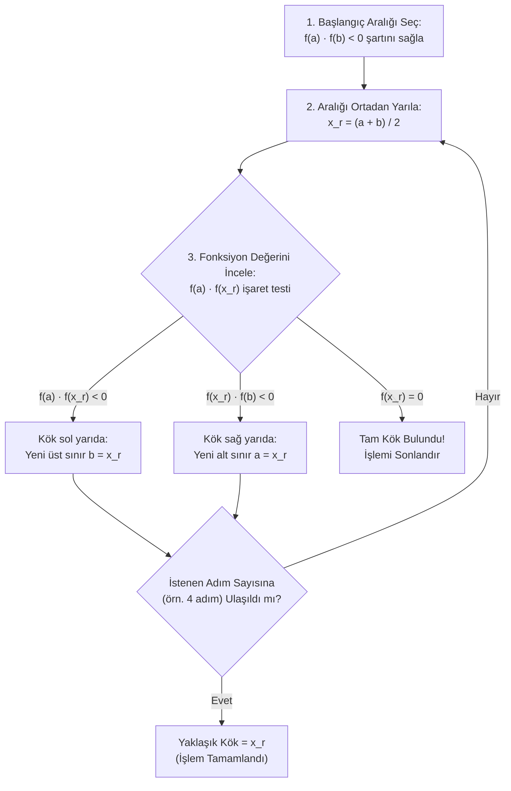

> 🧭 **Ders Akışı:** [[Sayısal yöntemler 03|🏠 Hafta 03: Ana Dizin (MOC)]] ➔ **[1. İkiye Bölme Yöntemi]** ➔ [[02 - Sabit Nokta İterasyonu|2. Sabit Nokta İterasyonu ➡️]]

---

# 🎯 01 - İkiye Bölme Yöntemi (Bisection Method)

Lineer olmayan (non-lineer) $f(x) = 0$ denklemlerinin analitik çözümü (kökleri tam formülle bulmak) çoğu zaman mümkün değildir veya çok zordur. Bu tür denklemlerin köklerini sayısal olarak yaklaşık bir değerle bulmak için kullanılan **en temel, en garantili fakat en yavaş** yöntem **İkiye Bölme Yöntemi**dir (Bisection Method).

---

## 1. Yöntemin Mantığı ve Matematiksel Temeli

İkiye bölme yöntemi, kalkülüsteki **Ara Değer Teoremi'nin (Bolzano Teoremi)** pratik bir uygulamasıdır.

### Bolzano (Ara Değer) Teoremi

> [!NOTE] 📐 Teorem
> $f(x)$ fonksiyonu $[a, b]$ kapalı aralığında sürekli olsun. Eğer aralığın uç noktalarında fonksiyon ters işaretli değerler alıyorsa; yani:
> 
> $$f(a) \cdot f(b) < 0$$
> 
> ise, bu aralıkta fonksiyon en az bir kez $x$ eksenini keser. Yani $f(r) = 0$ olacak şekilde **en az bir $r \in (a, b)$ reel kökü vardır.**

### Sezgisel Açıklama: "Yarıla, Fonksiyona Bak, Aralığa Karar Ver!"

Hocanın derste bahsettiği *"yarıla, fonksiyondaki değere bak, aralığa karar ver"* ifadesinin mantığı şudur:
1. Kökün nerede olduğunu tam bilmiyoruz ama $a$ ile $b$ arasında sıkıştığını biliyoruz ($f(a)$ ile $f(b)$ zıt işaretli).
2. Aralığı tam ortasından ikiye bölüyoruz: $x_r = \frac{a+b}{2}$.
3. $x_r$ noktasındaki fonksiyon değerini ($f(x_r)$) hesaplıyoruz.
4. $f(x_r)$'nin işareti $f(a)$ ile aynıysa, kök sağ taraftadır ($a$ yerine $x_r$ geçer). $f(x_r)$'nin işareti $f(b)$ ile aynıysa, kök sol taraftadır ($b$ yerine $x_r$ geçer).
5. Böylece kökün bulunduğu aralık her adımda yarı yarıya küçülür.

---

## 2. Standart 4 Adımlı Çözüm Algoritması (Sınav Şablonu)

Sınavda hoca ikiye bölme yöntemini sorduğunda aşağıdaki adımları sırayla takip ediniz:

1. **1. Adım (Aralık Belirleme):**  
   Fonksiyonun kökünü içine alan ve $f(a) \cdot f(b) < 0$ şartını sağlayan $x_{\text{alt}} = a$ ve $x_{\text{üst}} = b$ noktaları belirlenir.
2. **2. Adım (Kök Tahmini):**  
   Aralığın orta noktası hesaplanır:
   $$x_r = \frac{x_{\text{alt}} + x_{\text{üst}}}{2} = \frac{a + b}{2}$$
3. **3. Adım (İşaret Kontrolü ve Alt Aralık Seçimi):**  
   * **$f(a) \cdot f(x_r) < 0$ ise:** Kök $[a, x_r]$ arasındadır. Yeni üst sınır $b = x_r$ yapılır ($a$ sabit kalır).
   * **$f(x_r) \cdot f(b) < 0$ ise:** Kök $[x_r, b]$ arasındadır. Yeni alt sınır $a = x_r$ yapılır ($b$ sabit kalır).
   * **$f(x_r) = 0$ ise:** Kök tam olarak $x_r$'dir; işlem durdurulur.
4. **4. Adım (Döngü ve Durdurma Kriteri):**  
   Yeni aralıkla 2. adıma dönülür. Sınavda hoca genellikle **4 adım (4 iterasyon)** yapmamızı ister.

---

## 3. Örnek 1 Çözümü: $f(x) = x^3 - 2x - 5 = 0$

> [!QUESTION] Soru
> $f(x) = x^3 - 2x - 5 = 0$ denkleminin bir kökünü İkiye Bölme Yöntemi ile **4 adımda** bulunuz.

### Kolay Başlangıç Aralığının Belirlenmesi

> [!TIP] Sınav Taktiği: Kolay Sayı Seçimi
> Hoca *"genelde kolay 2 sayı seçip yöntemi kullanın"* demiştir. Bunun için küçük tam sayıları ($0, 1, 2, 3, \dots$) fonksiyonda yerine yazıp işaret değişimini ararız:
> * $f(0) = 0^3 - 2(0) - 5 = -5 < 0$
> * $f(1) = 1^3 - 2(1) - 5 = 1 - 2 - 5 = -6 < 0$
> * $f(2) = 2^3 - 2(2) - 5 = 8 - 4 - 5 = \mathbf{-1 < 0}$
> * $f(3) = 3^3 - 2(3) - 5 = 27 - 6 - 5 = \mathbf{+16 > 0}$
> 
> $f(2) = -1$ ve $f(3) = +16$ olduğundan:
> $$f(2) \cdot f(3) = (-1) \cdot (+16) = -16 < 0$$
> şartı sağlanır! O halde başlangıç aralığımız: **$[a_1, b_1] = [2, 3]$** olarak seçilir.

---

### Sınav Kağıdına Yazılacak 4 Adım:

#### Adım 1:
* **Aralık:** $[a_1, b_1] = [2, 3]$
* **Orta Nokta:**
  $$x_{r1} = \frac{a_1 + b_1}{2} = \frac{2 + 3}{2} = \mathbf{2{,}5}$$
* **Fonksiyon Değerleri:**
  $$f(a_1) = f(2) = -1$$
  $$f(x_{r1}) = f(2{,}5) = (2{,}5)^3 - 2(2{,}5) - 5 = 15{,}625 - 5 - 5 = \mathbf{+5{,}625}$$
* **İşaret Testi:**
  $$f(a_1) \cdot f(x_{r1}) = (-1) \cdot (+5{,}625) = -5{,}625 < 0$$
* **Karar:** Kök sol yarıdadır, yani $[2; 2{,}5]$ aralığındadır.
  * Yeni aralık: $a_2 = 2$, $b_2 = 2{,}5$.

---

#### Adım 2:
* **Aralık:** $[a_2, b_2] = [2; 2{,}5]$
* **Orta Nokta:**
  $$x_{r2} = \frac{a_2 + b_2}{2} = \frac{2 + 2{,}5}{2} = \mathbf{2{,}25}$$
* **Fonksiyon Değerleri:**
  $$f(a_2) = f(2) = -1$$
  $$f(x_{r2}) = f(2{,}25) = (2{,}25)^3 - 2(2{,}25) - 5 = 11{,}390625 - 4{,}5 - 5 = \mathbf{+1{,}890625}$$
* **İşaret Testi:**
  $$f(a_2) \cdot f(x_{r2}) = (-1) \cdot (+1{,}890625) < 0$$
* **Karar:** Kök sol yarıdadır, yani $[2; 2{,}25]$ aralığındadır.
  * Yeni aralık: $a_3 = 2$, $b_3 = 2{,}25$.

---

#### Adım 3:
* **Aralık:** $[a_3, b_3] = [2; 2{,}25]$
* **Orta Nokta:**
  $$x_{r3} = \frac{a_3 + b_3}{2} = \frac{2 + 2{,}25}{2} = \mathbf{2{,}125}$$
* **Fonksiyon Değerleri:**
  $$f(a_3) = f(2) = -1$$
  $$f(x_{r3}) = f(2{,}125) = (2{,}125)^3 - 2(2{,}125) - 5 = 9{,}595703 - 4{,}25 - 5 = \mathbf{+0{,}345703}$$
* **İşaret Testi:**
  $$f(a_3) \cdot f(x_{r3}) = (-1) \cdot (+0{,}345703) < 0$$
* **Karar:** Kök sol yarıdadır, yani $[2; 2{,}125]$ aralığındadır.
  * Yeni aralık: $a_4 = 2$, $b_4 = 2{,}125$.

---

#### Adım 4:
* **Aralık:** $[a_4, b_4] = [2; 2{,}125]$
* **Orta Nokta:**
  $$x_{r4} = \frac{a_4 + b_4}{2} = \frac{2 + 2{,}125}{2} = \mathbf{2{,}0625}$$
* **Fonksiyon Değerleri:**
  $$f(a_4) = f(2) = -1$$
  $$f(x_{r4}) = f(2{,}0625) = (2{,}0625)^3 - 2(2{,}0625) - 5 = 8{,}773682 - 4{,}125 - 5 = \mathbf{-0{,}351318}$$
* **İşaret Testi:**
  $$f(a_4) \cdot f(x_{r4}) = (-1) \cdot (-0{,}351318) = +0{,}351318 > 0$$
* **Karar:** $f(a_4) \cdot f(x_{r4}) > 0$ olduğundan kök sağ yarıdadır!
  * Yeni aralık: $[x_{r4}, b_4] = [2{,}0625; 2{,}125]$.

---

### Özet İterasyon Tablosu (Sınavda Tablo Çizilmesi İstenirse)

| Adım ($i$) | Alt Sınır ($a_i$) | Üst Sınır ($b_i$) | Kök Tahmini ($x_{ri}$) | $f(a_i)$ | $f(x_{ri})$ | $f(a_i) \cdot f(x_{ri})$ | Yeni Aralık |
| :---: | :---: | :---: | :---: | :---: | :---: | :---: | :---: |
| **1** | $2{,}0000$ | $3{,}0000$ | **$2{,}5000$** | $-1{,}0000$ | $+5{,}6250$ | $< 0$ (Negatif) | $[2{,}0000; 2{,}5000]$ |
| **2** | $2{,}0000$ | $2{,}5000$ | **$2{,}2500$** | $-1{,}0000$ | $+1{,}8906$ | $< 0$ (Negatif) | $[2{,}0000; 2{,}2500]$ |
| **3** | $2{,}0000$ | $2{,}2500$ | **$2{,}1250$** | $-1{,}0000$ | $+0{,}3457$ | $< 0$ (Negatif) | $[2{,}0000; 2{,}1250]$ |
| **4** | $2{,}0000$ | $2{,}1250$ | **$2{,}0625$** | $-1{,}0000$ | $-0{,}3513$ | $> 0$ (Pozitif) | $[2{,}0625; 2{,}1250]$ |

> [!CHECK] Sonuç ve Hata Değerlendirmesi
> * 4. adım sonundaki kök tahmini: $\mathbf{x \approx 2{,}0625}$
> * Denklemin gerçek analitik kökü: $x_{\text{gerçek}} \approx 2{,}09455$
> * Mutlak hata: $|2{,}09455 - 2{,}0625| = 0{,}03205$
> * Maksimum teorik hata sınırı: $\frac{b_1 - a_1}{2^4} = \frac{3 - 2}{16} = 0{,}0625$. Görüldüğü gibi gerçek hata teorik sınırın altındadır ($0{,}032 < 0{,}0625$).

---

## 4. Örnek 2 Çözümü: $f(x) = x^3 - 3 = 0$

> [!QUESTION] Soru
> $f(x) = x^3 - 3 = 0$ denkleminin pozitif kökünü İkiye Bölme Yöntemi ile **4 adımda** bulunuz. Negatif ve pozitif kök aralıklarını inceleyiniz.

### Kök Aralığı Analizi (Sınav Tuzağı ve Detaylı İnceleme)

1. **Pozitif Kök:**
   * $x^3 = 3 \implies x = \sqrt[3]{3} \approx 1{,}44225$ (Pozitif reel kök).
   * Kolay tamsayı aralığı seçimi:
     * $f(1) = 1^3 - 3 = \mathbf{-2 < 0}$
     * $f(2) = 2^3 - 3 = 8 - 3 = \mathbf{+5 > 0}$
     * $f(1) \cdot f(2) = (-2) \cdot (5) = -10 < 0 \implies$ **Pozitif kök $[1, 2]$ aralığındadır.**

2. **Negatif Kök İncelemesi (Önemli Not):**
   * Fonksiyonun türevi: $f'(x) = 3x^2 \ge 0$'dır. Fonksiyon daima artandır (monotoniktir).
   * $x \le 0$ için $x^3 \le 0 \implies f(x) = x^3 - 3 \le -3 < 0$'dır.
   * Yani negatif değerlerde fonksiyon ekseni asla kesmez. Bu nedenle denklemin **negatif bir reel kökü YOKTUR** (yalnızca 1 adet reel kökü vardır, o da pozitiftir; diğer iki kök karmaşıktır).
   > [!NOTE] Hoca Sınavda $x^2 - 3 = 0$ Sorsaydı?
   > Eğer denklem $f(x) = x^2 - 3 = 0$ olsaydı:
   > * Pozitif kök: $x = +\sqrt{3} \approx 1{,}732$ olup $[1, 2]$ aralığındadır ($f(1)=-2 < 0, f(2)=+1 > 0$).
   > * Negatif kök: $x = -\sqrt{3} \approx -1{,}732$ olup $[-2, -1]$ aralığındadır ($f(-2)=+1 > 0, f(-1)=-2 < 0$).

---

### $f(x) = x^3 - 3 = 0$ İçin 4 Adımlı Çözüm:

Başlangıç aralığı: $[a_1, b_1] = [1, 2]$

#### Adım 1:
* **Orta Nokta:** $x_{r1} = \frac{1 + 2}{2} = \mathbf{1{,}5}$
* **Değerler:** $f(a_1) = f(1) = -2$  
  $$f(x_{r1}) = f(1{,}5) = (1{,}5)^3 - 3 = 3{,}375 - 3 = \mathbf{+0{,}375}$$
* **Test:** $f(a_1) \cdot f(x_{r1}) = (-2) \cdot (+0{,}375) < 0 \implies$ Kök $[1; 1{,}5]$ aralığındadır.
  * Yeni aralık: $a_2 = 1$, $b_2 = 1{,}5$.

#### Adım 2:
* **Orta Nokta:** $x_{r2} = \frac{1 + 1{,}5}{2} = \mathbf{1{,}25}$
* **Değerler:** $f(a_2) = f(1) = -2$  
  $$f(x_{r2}) = f(1{,}25) = (1{,}25)^3 - 3 = 1{,}953125 - 3 = \mathbf{-1{,}046875}$$
* **Test:** $f(a_2) \cdot f(x_{r2}) = (-2) \cdot (-1{,}046875) > 0 \implies$ Kök sağ yarıdadır!
  * Yeni aralık: $a_3 = x_{r2} = 1{,}25$, $b_3 = 1{,}5$.

#### Adım 3:
* **Orta Nokta:** $x_{r3} = \frac{1{,}25 + 1{,}5}{2} = \mathbf{1{,}375}$
* **Değerler:** $f(a_3) = f(1{,}25) = -1{,}046875$  
  $$f(x_{r3}) = f(1{,}375) = (1{,}375)^3 - 3 = 2{,}599609 - 3 = \mathbf{-0{,}400391}$$
* **Test:** $f(a_3) \cdot f(x_{r3}) = (-1{,}046875) \cdot (-0{,}400391) > 0 \implies$ Kök sağ yarıdadır!
  * Yeni aralık: $a_4 = x_{r3} = 1{,}375$, $b_4 = 1{,}5$.

#### Adım 4:
* **Orta Nokta:** $x_{r4} = \frac{1{,}375 + 1{,}5}{2} = \mathbf{1{,}4375}$
* **Değerler:** $f(a_4) = f(1{,}375) = -0{,}400391$  
  $$f(x_{r4}) = f(1{,}4375) = (1{,}4375)^3 - 3 = 2{,}970459 - 3 = \mathbf{-0{,}029541}$$
* **Test:** $f(a_4) \cdot f(x_{r4}) = (-0{,}400391) \cdot (-0{,}029541) > 0 \implies$ Kök sağ yarıdadır!
  * Yeni aralık: $[1{,}4375; 1{,}5]$.

---

### Örnek 2 İterasyon Tablosu

| Adım ($i$) | $a_i$ | $b_i$ | $x_{ri}$ | $f(a_i)$ | $f(x_{ri})$ | $f(a_i) \cdot f(x_{ri})$ | Yeni Aralık |
| :---: | :---: | :---: | :---: | :---: | :---: | :---: | :---: |
| **1** | $1{,}0000$ | $2{,}0000$ | **$1{,}5000$** | $-2{,}0000$ | $+0{,}3750$ | $< 0$ | $[1{,}0000; 1{,}5000]$ |
| **2** | $1{,}0000$ | $1{,}5000$ | **$1{,}2500$** | $-2{,}0000$ | $-1{,}0469$ | $> 0$ | $[1{,}2500; 1{,}5000]$ |
| **3** | $1{,}2500$ | $1{,}5000$ | **$1{,}3750$** | $-1{,}0469$ | $-0{,}4004$ | $> 0$ | $[1{,}3750; 1{,}5000]$ |
| **4** | $1{,}3750$ | $1{,}5000$ | **$1{,}4375$** | $-0{,}4004$ | $-0{,}0295$ | $> 0$ | $[1{,}4375; 1{,}5000]$ |

> [!CHECK] Sonuç
> 4 adım sonunda elde edilen kök tahmini: $\mathbf{x \approx 1{,}4375}$.  
> Gerçek analitik değer $\sqrt[3]{3} \approx 1{,}44225$ olup hata yalnızca $|1{,}44225 - 1{,}4375| = 0{,}00475$'tir!

---

## 5. İkiye Bölme Yönteminin Hata Analizi ve Özellikleri

### Maksimum Hata Sınırı Formülü

İkiye bölme yönteminde her adımda aralık genişliği yarıya iner ($\frac{b-a}{2}$). Dolayısıyla $n$. adım sonunda kök tahmini $x_{rn}$ için **maksimum mutlak hata sınırı** daima bilinir:

$$E_n = |r - x_{rn}| \le \frac{b - a}{2^n}$$

### İstenen Hata Toleransı İçin Gerekli Adım Sayısı

Eğer sınavda *"Hatanın $\varepsilon$ değerinden küçük olması için en az kaç iterasyon yapılmalıdır?"* diye sorulursa:

$$\frac{b - a}{2^n} \le \varepsilon \implies 2^n \ge \frac{b - a}{\varepsilon} \implies \mathbf{n \ge \frac{\ln(b - a) - \ln(\varepsilon)}{\ln(2)}}$$

### Avantajları ve Dezavantajları

* **Avantajı:** $f(a) \cdot f(b) < 0$ şartı sağlandığı sürece **yakınsaması KESİNLİKLE GARANTİDİR** (asla ıraksamaz, patlamaz).
* **Dezavantajı:** Yakınsama hızı çok yavaştır (Lineer yakınsama / Linear convergence). Her adımda hassasiyet sadece 1 bit ($\approx 0{,}3$ ondalık basamak) artar.

---

> 🧭 **Gezinme:**  
> ⬅️ [[Sayısal yöntemler 03|Hafta 03 Ana Dizin (MOC)]] | [[02 - Sabit Nokta İterasyonu|Sonraki Konu: 02 - Sabit Nokta İterasyonu ➡️]]
