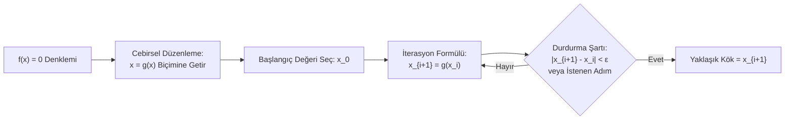

> 🧭 **Ders Akışı:** [[01 - İkiye Bölme Yöntemi (Bisection)|⬅️ 1. İkiye Bölme Yöntemi]] ➔ **[2. Sabit Nokta İterasyonu]** ➔ [[03 - Bilimsel Hesap Makinesi ve Sınav Taktikleri|3. Hesap Makinesi Rehberi ➡️]]

---

# 🔁 02 - Sabit Nokta İterasyonu (Fixed-Point Iteration)

Sabit Nokta İterasyonu (Tek Nokta İterasyonu), lineer olmayan $f(x) = 0$ denklemlerini çözmek için kullanılan en zarif ve güçlü açık (open) yöntemlerden biridir. İkiye bölme yöntemine göre çok daha hızlı köke ulaşabilir; ancak doğru formülasyon seçilmezse ıraksama (çözümden uzaklaşma / patlama) riski taşır.

---

## 1. Yöntemin Temel Mantığı

Yöntemin özü, $f(x) = 0$ denklemini cebirsel olarak bir $x$ değişkenini eşitliğin solunda yalnız bırakarak:

$$x = g(x)$$

şeklinde yeniden yazmaktır.

* Bu eşitliği sağlayan bir $r$ değerine ($r = g(r)$), $g$ fonksiyonunun **sabit noktası (fixed point)** denir.
* Geometrik olarak bu durum, $y = g(x)$ eğrisi ile $y = x$ doğrusunun kesiştiği noktayı bulmak demektir.

### İterasyon Bağıntısı

Bir $x_0$ başlangıç tahmini seçildikten sonra ardışık kök tahminleri şu şekilde hesaplanır:

$$\begin{aligned}
x_1 &= g(x_0) \\
x_2 &= g(x_1) \\
x_3 &= g(x_2) \\
&\;\;\vdots \\
x_{i+1} &= g(x_i)
\end{aligned}$$

---

## 2. Yakınsama Şartı: Ne Zaman Yakınsar, Ne Zaman Patlar?

Bir $f(x) = 0$ denkleminden $x = g(x)$ şeklinde sonsuz sayıda farklı fonksiyon türetilebilir. Ancak bunların **hepsi köke yakınsamaz!** Hangisinin yakınsayacağını belirleyen kural kalkülüsteki **Banach Sabit Nokta Teoremi**dir.

### 📐 Yakınsama Teoremi

> [!IMPORTANT] Mutlak Yakınsama Şartı (Sınavın 1 Numaralı Kuralı)
> $r$, $x = g(x)$ fonksiyonunun gerçek kökü ($r = g(r)$) olsun. Kökü içeren bir aralıkta $g(x)$ türetilebilir bir fonksiyon olmak üzere:
> 
> $$|g'(x)| < 1$$
> 
> ise iterasyon **KESİNLİKLE (mutlak olarak) köke yakınsar!**
> 
> * Eğer $|g'(x)| > 1$ ise iterasyon kökten uzaklaşır (**Iraksar / Diverges**).
> * Eğer $|g'(x)| = 1$ ise kritik durumdur (çok yavaş yakınsayabilir veya salınabilir).

### Yakınsamanın Karakteri (Türevin İşaretine Göre)

* **$0 < g'(x) < 1$ ise:** İterasyon değerleri köke **tek taraflı (monotonik)** olarak yaklaşır ($x_0 < x_1 < x_2 < \dots < r$).
* **$-1 < g'(x) < 0$ ise:** İterasyon değerleri kökün bir sağına bir soluna geçerek **salınımlı (örümcek ağı / cobweb spiral)** olarak köke yaklaşır.

> [!NOTE] 🔍 Dersteki Notun Analizi: *"|g'(x)| < 1 koşulu yeterli midir? |g'(x)| >= 1 iken yakınsayabilir mi?"*
> * Matematiksel olarak $|g'(x)| < 1$ koşulu kök komşuluğunda **yeterli bir şarttır (sufficiency condition)**. Yani bu şart sağlanıyorsa yakınsama garanti altındadır.
> * Eğer kökün tam üzerinde $|g'(r)| > 1$ ise kök bir *"itici sabit nokta"* (repeller) haline gelir; yani hiçbir iterasyon o köke oturamaz.
> * Ancak başlangıç noktası $x_0$ kökten uzaktayken o an $|g'(x_0)| \ge 1$ olsa bile, atılan ilk adım tesadüfen $|g'(x)| < 1$ olan çekim havzasına (basin of attraction) düşerse köke yaklaşabilir. Sınavda hocanın sizden beklediği temel analiz: **Kök civarında $|g'(x)| < 1$ olduğunu göstermenizdir!**

---

## 3. 🎯 Hocanın Taktiğinin Doğrulanması ve Matematiksel İspatı

> [!TIP] 🧠 Dersteki Taktik Notu:
> *"Taktik: Denklemin en yüksek derecesi olan kuvvetini kullanarak yalnız bırakarak denersek en hızlı şekilde bulabiliriz gibisinden bir şey dedi hoca. Bu bilgiyi doğrulamamız gerek..."*

### Bu Taktik Doğru mudur? Evet, Kesinlikle Doğrudur! İşte Matematiksel Sebebi:

Bir $x^n + ax + b = 0$ polinomunu ele alalım ($n \ge 2$). $x$'i yalnız bırakmanın temel iki yolu vardır:

#### 1. Yol: Düşük Dereceli (Lineer) Terimi Yalnız Bırakmak (YANLIŞ YOL)
$$ax = -(x^n + b) \implies x = g(x) = -\frac{x^n + b}{a}$$
Türevini alırsak:
$$g'(x) = -\frac{n \cdot x^{n-1}}{a}$$
* Eğer $|x| > 1$ ise paydaki $x^{n-1}$ üssü sayıyı hızla büyütür ve $|g'(x)| \gg 1$ olur!
* Sonuç: **İterasyon kesinlikle patlar ve sonsuza ıraksar!**

#### 2. Yol (Hocanın Taktiği): En Yüksek Dereceyi Yalnız Bırakıp Kök Almak (DOĞRU YOL)
$$x^n = -(ax + b) \implies x = g(x) = [-(ax + b)]^{1/n}$$
Türevini zincir kuralıyla alırsak:
$$g'(x) = \frac{1}{n} [-(ax + b)]^{\frac{1}{n} - 1} \cdot (-a) = \mathbf{\frac{-a}{n \cdot x^{n-1}}}$$
* Dikkat ediniz: Hem paydada $n$ çarpanı vardır (bölme yapar), hem de $x^{n-1}$ terimi **paydaya inmiştir**!
* Kök civarında $|x| > 1$ olduğunda payda devasa büyür, bu da türevi sıfıra yaklaştırır: **$|g'(x)| \ll 1$**.
* Sonuç: Kök alma işlemi eğriyi yataylaştırır (eğim küçülür), böylece iterasyon **aşırı hızlı ve garantili biçimde köke yakınsar!**

---

## 4. Örnek 1 Çözümü: $x^3 - 2x - 5 = 0$

> [!QUESTION] Soru
> $x^3 - 2x - 5 = 0$ denkleminin yaklaşık kökü $r \approx 2{,}09455$'tir. $x_0 = 1$ başlangıç değerini alarak Sabit Nokta İterasyonu ile kökü adım adım bulunuz ($x_7$'ye kadar hesaplayınız).

### 1. Uygun $g(x)$ Fonksiyonunun Seçimi ve Türev Kontrolü

Hocanın taktiğini uygulayarak en yüksek dereceli terim olan $x^3$'ü yalnız bırakıyoruz:
$$x^3 = 2x + 5 \implies \mathbf{x = g(x) = \sqrt[3]{2x + 5} = (2x + 5)^{1/3}}$$

Türevini alalım:
$$g'(x) = \frac{1}{3}(2x + 5)^{-2/3} \cdot 2 = \mathbf{\frac{2}{3(2x + 5)^{2/3}}}$$

* Başlangıç noktasında kontrol: $x_0 = 1$ için:
  $$g'(1) = \frac{2}{3(7)^{2/3}} \approx \frac{2}{3 \times 3{,}6593} \approx \mathbf{0{,}1822} < 1 \quad \text{(Garantili Yakınsar!)}$$
* Kök civarında kontrol: $x \approx 2{,}09455$ için:
  $$g'(2{,}09455) = \frac{2}{3(9{,}1891)^{2/3}} \approx \frac{2}{3 \times 4{,}3875} \approx \mathbf{0{,}1520} \ll 1 \quad \text{(Çok Hızlı Yakınsar!)}$$

---

### 2. Adım Adım İterasyon Hesaplamaları ($x_0 = 1$ Başlangıcıyla)

İterasyon bağıntımız:
$$\mathbf{x_{i+1} = \sqrt[3]{2x_i + 5}}$$

* **$i = 0$ ($x_1$ Hesabı):**
  $$x_1 = \sqrt[3]{2(1) + 5} = \sqrt[3]{7} \approx \mathbf{1{,}912931}$$
* **$i = 1$ ($x_2$ Hesabı):**
  $$x_2 = \sqrt[3]{2(1{,}912931) + 5} = \sqrt[3]{8{,}825862} \approx \mathbf{2{,}066581}$$
* **$i = 2$ ($x_3$ Hesabı):**
  $$x_3 = \sqrt[3]{2(2{,}066581) + 5} = \sqrt[3]{9{,}133162} \approx \mathbf{2{,}090292}$$
* **$i = 3$ ($x_4$ Hesabı):**
  $$x_4 = \sqrt[3]{2(2{,}090292) + 5} = \sqrt[3]{9{,}180584} \approx \mathbf{2{,}093904}$$
* **$i = 4$ ($x_5$ Hesabı):**
  $$x_5 = \sqrt[3]{2(2{,}093904) + 5} = \sqrt[3]{9{,}187808} \approx \mathbf{2{,}094453}$$
* **$i = 5$ ($x_6$ Hesabı):**
  $$x_6 = \sqrt[3]{2(2{,}094453) + 5} = \sqrt[3]{9{,}188906} \approx \mathbf{2{,}094537}$$
* **$i = 6$ ($x_7$ Hesabı):**
  $$x_7 = \sqrt[3]{2(2{,}094537) + 5} = \sqrt[3]{9{,}189074} \approx \mathbf{2{,}094549}$$
* **$i = 7$ ($x_8$ Hesabı):**
  $$x_8 = \sqrt[3]{2(2{,}094549) + 5} = \sqrt[3]{9{,}189098} \approx \mathbf{2{,}094551}$$
* **$i = 8$ ($x_9$ Hesabı):**
  $$x_9 = \sqrt[3]{2(2{,}094551) + 5} \approx \mathbf{2{,}094551}$$

---

### Özet İterasyon Tablosu

| İterasyon ($i$) | $x_i$ Değeri | $g'(x_i)$ | Bağıl Yaklaşım Hatası ($\varepsilon_y$) | Durum |
| :---: | :---: | :---: | :---: | :--- |
| **0** | $1{,}000000$ | $0{,}182184$ | — | Başlangıç noktası |
| **1** | $1{,}912931$ | $0{,}156100$ | $\% 47{,}7$ | Hızlı yaklaşma |
| **2** | $2{,}066581$ | $0{,}152579$ | $\% 7{,}43$ | Köke çok yakın |
| **3** | $2{,}090292$ | $0{,}152053$ | $\% 1{,}13$ | 2 ondalık basamak sabitlendi |
| **4** | $2{,}093904$ | $0{,}151973$ | $\% 0{,}17$ | 3 ondalık basamak sabitlendi |
| **5** | $2{,}094453$ | $0{,}151961$ | $\% 0{,}026$ | 4 ondalık basamak sabitlendi |
| **6** | $2{,}094537$ | $0{,}151959$ | $\% 0{,}004$ | 4 basamak ($2{,}0945$) tam oturdu |
| **7** | **$2{,}094549$** | $0{,}151959$ | $\% 0{,}0005$ | 5 basamak sabitlendi |
| **8** | **$2{,}094551$** | $0{,}151959$ | $\% 0{,}00009$ | Makine hassasiyeti limitinde |

> [!CHECK] İterasyon Neden Kesilir?
> Notta yer alan *"İterasyonu kesebiliriz çünkü artık $x_7, x_8, x_9$ terimlerinin ilk basamakları aynı olacaktır"* ifadesinin sebebi:  
> $x_6 = 2{,}094537$, $x_7 = 2{,}094549$ ve $x_8 = 2{,}094551$ değerlerinde virgülden sonraki ilk 4-5 basamak tamamen aynıdır ($2{,}0945$). Fark ancak milyonda birler basamağındadır. Dolayısıyla kök **$\mathbf{x \approx 2{,}09455}$** olarak kesinleşmiştir.

---

## 5. Örnek 2 Çözümü: $x \cdot e^{0{,}5x} + 1{,}2x - 5 = 0$

> [!QUESTION] Soru
> $x \cdot e^{0{,}5x} + 1{,}2x - 5 = 0$ denklemini ele alalım. Denklemin yaklaşık çözümü $x \approx 1{,}5050$ olduğuna göre, $x_0 = 1$ başlangıç değerini kullanarak Sabit Nokta İterasyonu ile çözümü bulunuz.

### 1. Fonksiyonu $x = g(x)$ Şekline Dönüştürme Analizi (Türev Tuzağı)

Bu denklemden $x$'i yalnız bırakmak için karşımıza çıkabilecek alternatifleri inceleyelim:

* **Alternatif 1 (Hatalı Dönüşüm):**
  $$1{,}2x = 5 - x e^{0{,}5x} \implies x = g_1(x) = \frac{5 - x e^{0{,}5x}}{1{,}2}$$
  Türevi: $g_1'(1{,}5050) \approx \mathbf{-3{,}10}$. $|g_1'| = 3{,}10 > 1$ olduğundan **IRAKSAR (Patlar!)**.
* **Alternatif 2 (Hatalı Dönüşüm):**
  $$x e^{0{,}5x} = 5 - 1{,}2x \implies x = g_2(x) = (5 - 1{,}2x) e^{-0{,}5x}$$
  Türevi: $g_2'(1{,}5050) \approx \mathbf{-1{,}32}$. $|g_2'| = 1{,}32 > 1$ olduğundan **IRAKSAR (Patlar!)**.
* **Alternatif 3 (DOĞRU DÖNÜŞÜM - $x$ Parantezine Alma):**
  $$x (e^{0{,}5x} + 1{,}2) = 5 \implies \mathbf{x = g(x) = \frac{5}{e^{0{,}5x} + 1{,}2}}$$

---

### 2. Doğru Dönüşümün Türev Kontrolü

$$g(x) = 5 \cdot \left(e^{0{,}5x} + 1{,}2\right)^{-1}$$

Bölümün veya zincir kuralının türevinden:
$$g'(x) = -5 \cdot \left(e^{0{,}5x} + 1{,}2\right)^{-2} \cdot \left(0{,}5 e^{0{,}5x}\right) = \mathbf{-\frac{2{,}5 e^{0{,}5x}}{\left(e^{0{,}5x} + 1{,}2\right)^2}}$$

Kök civarında ($x \approx 1{,}5050$ için):
* $e^{0{,}5 \times 1{,}5050} = e^{0{,}7525} \approx 2{,}1223$
* Pay: $-2{,}5 \times 2{,}1223 \approx -5{,}3058$
* Payda: $(2{,}1223 + 1{,}2)^2 = (3{,}3223)^2 \approx 11{,}0377$
* Türev Değeri:
  $$g'(1{,}5050) \approx \frac{-5{,}3058}{11{,}0377} \approx \mathbf{-0{,}4807}$$

> [!IMPORTANT] Yakınsama Yorumu
> $$|g'(1{,}5050)| = |-0{,}4807| = \mathbf{0{,}4807 < 1}$$
> Şart sağlandığı için iterasyon **KESİNLİKLE YAKINSAR!**  
> Ayrıca türev negatif ($-0{,}48 < 0$) olduğu için iterasyon adımları kökün etrafında **salınarak (büyüklü-küçüklü)** köke yaklaşacaktır.

---

### 3. Adım Adım İterasyon Hesaplamaları ($x_0 = 1$)

İterasyon formülü:
$$\mathbf{x_{i+1} = \frac{5}{e^{0{,}5 x_i} + 1{,}2}}$$

* **$i = 0$ ($x_1$ Hesabı):**
  $$x_1 = \frac{5}{e^{0{,}5(1)} + 1{,}2} = \frac{5}{1{,}648721 + 1{,}2} = \frac{5}{2{,}848721} \approx \mathbf{1{,}755173}$$
* **$i = 1$ ($x_2$ Hesabı):**
  $$x_2 = \frac{5}{e^{0{,}5(1{,}755173)} + 1{,}2} = \frac{5}{e^{0{,}877587} + 1{,}2} = \frac{5}{2{,}405101 + 1{,}2} \approx \mathbf{1{,}386928}$$
* **$i = 2$ ($x_3$ Hesabı):**
  $$x_3 = \frac{5}{e^{0{,}5(1{,}386928)} + 1{,}2} = \frac{5}{e^{0{,}693464} + 1{,}2} = \frac{5}{2{,}000673 + 1{,}2} \approx \mathbf{1{,}562190}$$
* **$i = 3$ ($x_4$ Hesabı):**
  $$x_4 = \frac{5}{e^{0{,}5(1{,}562190)} + 1{,}2} = \frac{5}{2{,}183884 + 1{,}2} \approx \mathbf{1{,}477601}$$
* **$i = 4$ ($x_5$ Hesabı):**
  $$x_5 = \frac{5}{e^{0{,}5(1{,}477601)} + 1{,}2} = \frac{5}{2{,}093452 + 1{,}2} \approx \mathbf{1{,}518177}$$
* **$i = 5$ ($x_6$ Hesabı):**
  $$x_6 = \frac{5}{e^{0{,}5(1{,}518177)} + 1{,}2} = \frac{5}{2{,}136340 + 1{,}2} \approx \mathbf{1{,}498654}$$
* **$i = 6$ ($x_7$ Hesabı):**
  $$x_7 = \frac{5}{e^{0{,}5(1{,}498654)} + 1{,}2} = \frac{5}{2{,}115594 + 1{,}2} \approx \mathbf{1{,}508034}$$
* **$i = 7$ ($x_8$ Hesabı):**
  $$x_8 \approx \mathbf{1{,}503525}$$
* **$i = 8$ ($x_9$ Hesabı):**
  $$x_9 \approx \mathbf{1{,}505707}$$

---

### Özet İterasyon Tablosu

| Adım ($i$) | $x_i$ | $e^{0{,}5 x_i} + 1{,}2$ | $x_{i+1}$ | Yakınsama Hareketi |
| :---: | :---: | :---: | :---: | :--- |
| **0** | $1{,}000000$ | $2{,}848721$ | **$1{,}755173$** | Kökün sağına geçti ($> 1{,}505$) |
| **1** | $1{,}755173$ | $3{,}605101$ | **$1{,}386928$** | Kökün soluna geçti ($< 1{,}505$) |
| **2** | $1{,}386928$ | $3{,}200673$ | **$1{,}562190$** | Tekrar sağa geçti ($> 1{,}505$) |
| **3** | $1{,}562190$ | $3{,}383884$ | **$1{,}477601$** | Tekrar sola geçti ($< 1{,}505$) |
| **4** | $1{,}477601$ | $3{,}293452$ | **$1{,}518177$** | Sağa geçti (aralık daralıyor) |
| **5** | $1{,}518177$ | $3{,}336340$ | **$1{,}498654$** | Sola geçti (hata küçülüyor) |
| **6** | $1{,}498654$ | $3{,}315594$ | **$1{,}508034$** | Sağa geçti |
| **7** | $1{,}508034$ | $3{,}325557$ | **$1{,}503525$** | Sola geçti |
| **8** | $1{,}503525$ | $3{,}320766$ | **$1{,}505707$** | $\approx 1{,}5050$ civarına kilitlendi |

> [!CHECK] Sonuç
> İterasyon değerleri $1{,}5050$ kökünün etrafında daralan bir spiral çizerek nihayetinde **$\mathbf{x \approx 1{,}5050}$** değerine başarıyla yakınsamıştır.

---

## 📌 Sınav İçin Altın Kurallar

1. **Dönüşüm Seçimi:** Denklemi $x = g(x)$ yaparken daima hocanın taktiğini hatırla: En yüksek dereceli terimi yalnız bırakıp kök al veya ortak $x$ parantezine alıp paydaya at.
2. **Türev Testi Yapmadan Başlama:** Sınavda tam puan almak için iterasyona başlamadan önce kağıda mutlaka $|g'(x)| < 1$ kontrolünü yaz!
3. **Durdurma Anı:** İki ardışık terim arasındaki fark (veya ilk virgülden sonraki basamaklar) istenen hassasiyete ulaştığında iterasyonu sonlandır ve son adımı kök olarak ilan et.

---

> 🧭 **Gezinme:**  
> ⬅️ [[01 - İkiye Bölme Yöntemi (Bisection)|1. Konu: İkiye Bölme Yöntemi]] | [[03 - Bilimsel Hesap Makinesi ve Sınav Taktikleri|Sonraki Konu: 03 - Hesap Makinesi Rehberi ➡️]]
