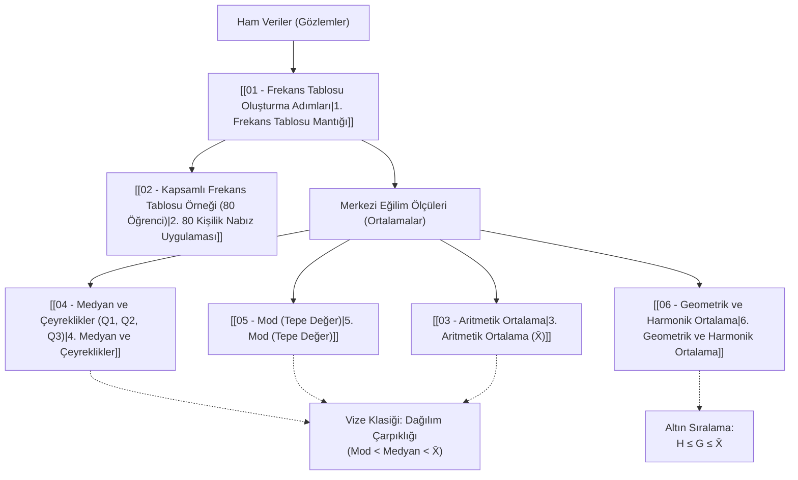

			# 2. Hafta: Verilerin Düzenlenmesi ve Merkezi Eğilim Ölçüleri

Bu dosya, 2. haftada işlenen tüm konuların bağlantı haritasını (MOC - Map of Content), mantıksal çalışma sırasını ve sınav öncesi hızlı tekrar formül özetini içerir.

---

## 📌 Mantıksal Konu Akışı (Nasıl Çalışmalı?)

---

## 📚 Ders Notları Modülleri

1. **[[01 - Frekans Tablosu Oluşturma Adımları]]**
   * Verilerin sınıflandırılması mantığı
   * 7 adımlık tablo oluşturma süreci ($k, c, A_s, U_s, S_i, f_i, P_i$)
   * "-den az" ve "-den çok" birikimli frekans kavramları
   * 50 kişilik sınav notları tablosu (Örnek 1)

2. **[[02 - Kapsamlı Frekans Tablosu Örneği (80 Öğrenci)]]**
   * 80 öğrencinin istirahat nabız verileri üzerinden 7 adımın tek tek uygulanışı
   * Veri düzenleme, aralık tayini ve eksiksiz frekans tablosu

3. **[[03 - Aritmetik Ortalama]]**
   * Ham verilerde aritmetik ortalama
   * Sınıflandırılmış verilerde ağırlıklı ortalama: $\bar{X} = \frac{\sum f_i S_i}{n}$
   * Slayttaki **Örnek 1.7** çözümü ve tahta görseli

4. **[[04 - Medyan ve Çeyreklikler (Q1, Q2, Q3)]]**
   * Medyan (ortanca) hesabı: Ham veride sıra, sınıflandırılmış veride enterpolasyon
   * Çeyreklikler ($Q_1, Q_2, Q_3$) ve Yüzdeliklerle ($P_{25}, P_{50}, P_{75}$) birebir ilişkisi
   * Çeyrekler Açıklığı ($IQR = Q_3 - Q_1$)
   * Slayttaki **Örnek 1.13** (8 hastanın iyileşme günleri) çözümü ve tahta görseli

5. **[[05 - Mod (Tepe Değer)]]**
   * En çok tekrar eden değer mantığı (unimodal, bimodal, modsuz)
   * Sınıflandırılmış veride mod formülü: $\text{Mod} = L + c \left(\frac{\Delta_1}{\Delta_1 + \Delta_2}\right)$
   * $\Delta_1$ ve $\Delta_2$ farklarının tespiti
   * Dağılım şekli / çarpıklık ilişkisi ($\text{Mod} < \text{Medyan} < \bar{X}$)

6. **[[06 - Geometrik ve Harmonik Ortalama]]**
   * Geometrik ortalama ($G$): Çarpımların $n$. kökü ve logaritmik çözüm
   * Harmonik ortalama ($H$): Terslerin ortalamasının tersi
   * 80 kişilik nabız verisi üzerinde $G \approx 76.42$ ve $H \approx 75.64$ çözümü
   * Ortalamalar arası altın sıralama: $H \le G \le \bar{X}$

---

## ⚡ Sınav Öncesi Hızlı Formül Kartı

| Ölçüt | Ham Veri Formülü | Sınıflandırılmış (Gruplandırılmış) Veri Formülü |
| :--- | :---: | :---: |
| **Aritmetik Ortalama ($\bar{X}$)** | $\frac{\sum X_i}{n}$ | $\frac{\sum (f_i \cdot S_i)}{n}$ |
| **Medyan ($\tilde{X} = Q_2$)** | Ortadaki değer / iki değerin ortalaması | $L + \frac{c}{f} \left(\frac{n}{2} - d\right)$ |
| **1. Çeyreklik ($Q_1 \equiv P_{25}$)** | $\frac{n}{4}$. sıradaki değer | $L + \frac{c}{f} \left(\frac{n}{4} - d\right)$ |
| **3. Çeyreklik ($Q_3 \equiv P_{75}$)** | $\frac{3n}{4}$. sıradaki değer | $L + \frac{c}{f} \left(\frac{3n}{4} - d\right)$ |
| **Mod ($\text{Tepe Değer}$)** | En çok tekrarlanan $X_i$ | $L + c \left(\frac{\Delta_1}{\Delta_1 + \Delta_2}\right)$ |
| **Geometrik Ortalama ($G$)** | $\sqrt[n]{\prod X_i} \iff 10^{\frac{\sum \log X_i}{n}}$ | $\sqrt[n]{\prod S_i^{f_i}} \iff 10^{\frac{\sum (f_i \log S_i)}{n}}$ |
| **Harmonik Ortalama ($H$)** | $\frac{n}{\sum (1/X_i)}$ | $\frac{n}{\sum (f_i / S_i)}$ |
| **Çeyrekler Açıklığı ($IQR$)** | $Q_3 - Q_1$ | $Q_3 - Q_1$ |

> [!TIP]
> **Görsel Harita:** Konular arasındaki ilişkileri şematik olarak görmek için klasördeki `2. Hafta - Konu Akışı ve Formüller.canvas` dosyasını açabilirsiniz.
